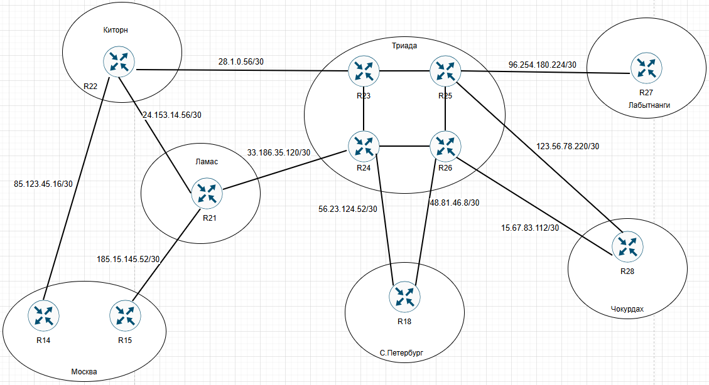
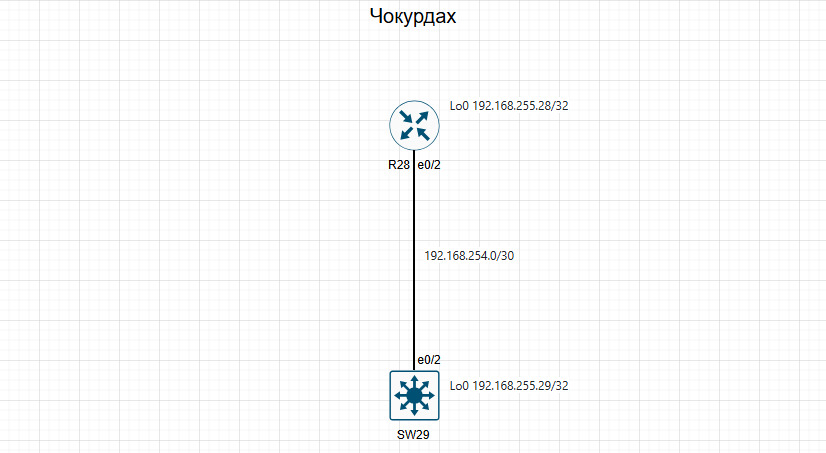
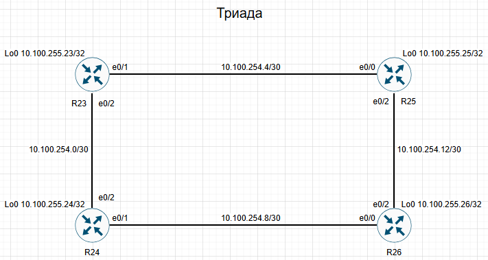

# Архитектура сети.

### План работ:

1. Разработать и задокументировать адресное пространство для лабораторного стенда.
2. Настроить ip адреса на каждом активном порту
3. Настроить каждый VPC в каждом офисе в своем VLAN.
4. Настроить VLAN/Loopbackup interface управления для сетевых устройств
5. Настроить сети офисов так, чтобы не возникало broadcast штормов, а использование линков было максимально оптимизировано
6. Использовать IPv4.

#### Префиксы по регионам:
  1. Москва: 10.10.0.0/16
  2. Санкт-петербург: 172.20.0.0/16
  3. Ламас: 37.24.0.0/16
  4. Киторн: 193.12.0.0/16
  5. Триада: 10.100.0.0/16
  6. Лабытнанги: 172.31.0.0/16
  7. Чокурдах: 192.168.0.0/16

### IP адреса соединений между регионами:
  1. Москва(R14) - Киторн(R22): 85.123.45.16/30
  2. Москва(R15) - Ламас(R21):  185.15.145.52/30
  3. Киторн(R22) - Ламас(R21):  24.153.14.56/30
  4. Киторн(R22) - Триада(R23): 28.1.0.56/30
  5. Ламас(R21)  - Триада(R24): 33.186.35.120/30
  6. Триада(R24) - С.-Петербург(R18): 56.23.124.52/30
  7. Триада(R26) - С.-Петербург(R18): 48.81.46.8/30
  8. Триада(R25) - Лабытнанги(R27): 96.254.180.224/30
  9. Триада(R25) - Чокурдах(R28): 123.56.78.220/30
  10. Триада(R26) - Чокурдах(R28): 15.67.83.112/30

#### Схема

### Киторн

| Equip | Port | Address                  | Network                | Description   |
|-------|------|--------------------------|------------------------|---------------|
|  R22  | e0/0 | 85.123.45.17/30          |85.123.45.16/30         | R22 to R14    |
|  R22  | e0/1 | 24.153.14.57/30          |24.153.14.56/30         | R22 to R21    |
|  R22  | e0/2 | 28.1.0.57/30             |28.1.0.56/30            | R22 to R23    |
|  R22  | Lo0  | 193.12.255.22/32         |                        | Loopback      |

### Ламас

| Equip | Port | Address                  | Network                | Description   |
|-------|------|--------------------------|------------------------|---------------|
|  R21  | e0/0 | 185.15.145.53/30         |185.15.145.52/30        | R21 to R15    |
|  R21  | e0/1 | 24.153.14.58/30          |24.153.14.56/30         | R21 to R22    |
|  R21  | e0/2 | 33.186.35.121/30         |33.186.35.120/30        | R21 to R24    |
|  R21  | Lo0  | 37.24.255.21/32          |                        | Loopback      |

### Лабытнанги

| Equip | Port | Address                  | Network                | Description   |
|-------|------|--------------------------|------------------------|---------------|
|  R27  | e0/0 | 96.254.180.226/30        |96.254.180.224/30       | R27 to R25    |
|  R27  | Lo0  | 172.31.255.27/32         |                        | Loopback      |

### Чокурдах

| Equip | Port | Address                  | Network                | Description   |
|-------|------|--------------------------|------------------------|---------------|
|  R28  | e0/0        | 15.67.83.114/30          |15.67.83.112/30         | R28 to R26    |
|  R28  | e0/1        | 123.56.78.222/30         |123.56.78.220/30        | R28 to R25    |
|  R28  | e0/2        | 192.168.254.1/30         |192.168.254.0/30        | R28 to SW29   |
|  R28  | Lo0         | 192.168.255.28/32        |                        | Loopback      |
|  SW29 | e0/2        | 192.168.254.2/30         |192.168.254.0/30        | SW29 to R28   |
|  SW29 | int vlan 50 | 192.168.50.1/24          |192.168.50.0/24         | vlan 50       |
|  SW29 | int vlan 60 | 192.168.60.1/24          |192.168.60.0/24         | vlan 60       |
|  SW29 | Lo0         | 192.168.255.29/32        |                        | Loopback      |

Графическая схема L3

### Триада

| Equip | Port | Address                  | Network                | Description   |
|-------|------|--------------------------|------------------------|---------------|
|  R23  | e0/0        | 28.1.0.58/30             |28.1.0.56/30           | R23 to R22    |
|  R23  | e0/1        | 10.100.254.5/30          |10.100.254.4/30        | R23 to R25    |
|  R23  | e0/2        | 10.100.254.1/30          |10.100.254.0/30        | R23 to R24    |
|  R23  | Lo0         | 10.100.255.23/32         |                       | Loopback      |
|  R24  | e0/0        | 33.186.35.122/30         |33.186.35.120/30       | R24 to R21    |
|  R24  | e0/1        | 10.100.254.9/30          |10.100.254.8/30        | R24 to R26    |
|  R24  | e0/2        | 10.100.254.2/30          |10.100.254.0/30        | R24 to R23    |
|  R24  | e0/3        | 56.23.124.53/30          |56.23.124.52/30        | R24 to R18    |
|  R24  | Lo0         | 10.100.255.24/32         |                       | Loopback      |
|  R25  | e0/0        | 10.100.254.6/30          |10.100.254.4/30        | R25 to R23    |
|  R25  | e0/1        | 96.254.180.225/30        |96.254.180.224/30      | R25 to R27    |
|  R25  | e0/2        | 10.100.254.13/30         |10.100.254.12/30       | R25 to R26    |
|  R25  | e0/3        | 123.56.78.221/30         |123.56.78.220/30       | R25 to R28    |
|  R25  | Lo0         | 10.100.255.25/32         |                       | Loopback      |
|  R26  | e0/0        | 10.100.254.10/30         |10.100.254.8/30        | R26 to R24    |
|  R26  | e0/1        | 15.67.83.113/30          |15.67.83.112/30        | R26 to R28    |
|  R26  | e0/2        | 10.100.254.14/30         |10.100.254.12/30       | R26 to R25    |
|  R26  | e0/3        | 48.81.46.9/30            |48.81.46.8/30          | R26 to R18    |
|  R26  | Lo0         | 10.100.255.26/32         |                       | Loopback      |

Графическая схема L3

