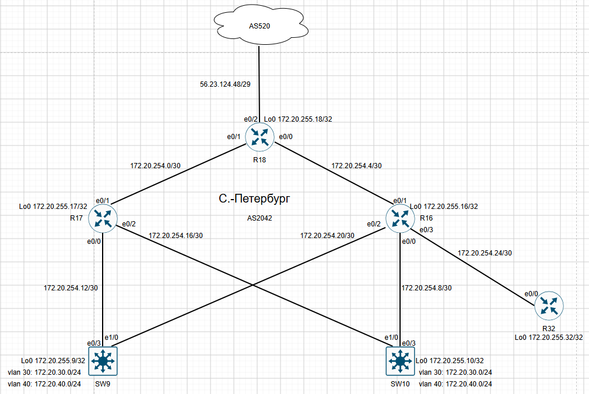

# Настроить DHCP и синхронизацию времени в офисе Москва, а также NAT в офисах Москва, C.-Перетбруг и Чокурдах.

# План работ:

1. Настроить NAT(PAT) на R14 и R15. Трансляция должна осуществляться в адрес автономной системы AS1001.
2. Настроить NAT(PAT) на R18. Трансляция должна осуществляться в пул из 5 адресов автономной системы AS2042.
3. Настроить статический NAT для R20.
4. Настроить NAT так, чтобы R19 был доступен с любого узла для удаленного управления.
5. Настроить статический NAT(PAT) для офиса Чокурдах.
6. Настроить для IPv4 DHCP сервер в офисе Москва на маршрутизаторах R12 и R13. VPC1 и VPC7 должны получать сетевые настройки по DHCP.
7. Настроить NTP сервер на R12 и R13. Все устройства в офисе Москва должны синхронизировать время с R12 и R13.
8. Все офисы в лабораторной работе должны иметь IP связность.

### Начнём с маршрутизатора R18(Cанкт Петербург).



Настроим Pool для внешних адресов, access-list и пропишем входящие и исходящий интерфейс для трансляции.

```
R18#
access-list 1 permit 172.20.30.0 0.0.0.255
access-list 1 permit 172.20.40.0 0.0.0.255
!
interface Ethernet0/0
 description R18 to R16
 ip address 172.20.254.5 255.255.255.252
 ip nat inside
!
interface Ethernet0/1
 description R18 to R17
 ip address 172.20.254.2 255.255.255.252
 ip nat inside
!
interface Ethernet0/2
 description R18 to R24
 ip address 56.23.124.53 255.255.255.248
 ip nat outside
!
ip nat pool AS2042 56.23.124.49 56.23.124.53 netmask 255.255.255.248
ip nat inside source list 1 pool AS2042 overload
```
### Настроим NAT в Москве(R14,R15)
