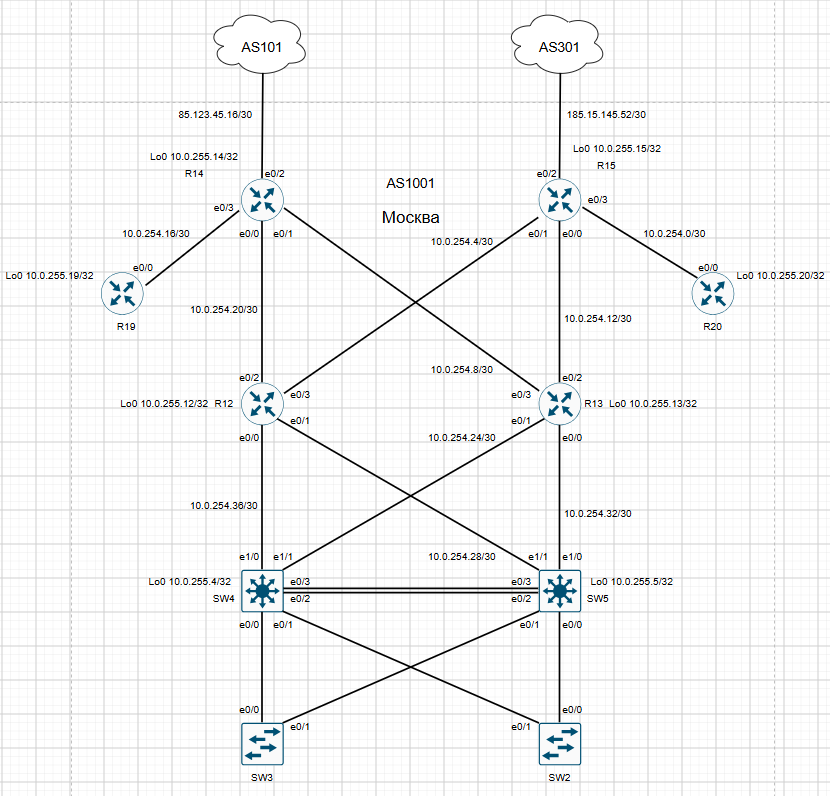

# Настроить DHCP и синхронизацию времени в офисе Москва, а также NAT в офисах Москва, C.-Перетбруг и Чокурдах.

# План работ:

1. Настроить NAT(PAT) на R14 и R15. Трансляция должна осуществляться в адрес автономной системы AS1001.
2. Настроить NAT(PAT) на R18. Трансляция должна осуществляться в пул из 5 адресов автономной системы AS2042.
3. Настроить статический NAT для R20.
4. Настроить NAT так, чтобы R19 был доступен с любого узла для удаленного управления.
5. Настроить статический NAT(PAT) для офиса Чокурдах.
6. Настроить для IPv4 DHCP сервер в офисе Москва на маршрутизаторах R12 и R13. VPC1 и VPC7 должны получать сетевые настройки по DHCP.
7. Настроить NTP сервер на R12 и R13. Все устройства в офисе Москва должны синхронизировать время с R12 и R13.
8. Все офисы в лабораторной работе должны иметь IP связность.

### Начнём с маршрутизатора R18(Cанкт Петербург).


Настроим Pool для внешних адресов, access-list и пропишем входящие и исходящий интерфейс для трансляции.

```
R18#
access-list 1 permit 172.20.30.0 0.0.0.255
access-list 1 permit 172.20.40.0 0.0.0.255
!
interface Ethernet0/0
 description R18 to R16
 ip address 172.20.254.5 255.255.255.252
 ip nat inside
!
interface Ethernet0/1
 description R18 to R17
 ip address 172.20.254.2 255.255.255.252
 ip nat inside
!
interface Ethernet0/2
 description R18 to R24
 ip address 56.23.124.53 255.255.255.248
 ip nat outside
!
ip nat pool AS2042 56.23.124.49 56.23.124.53 netmask 255.255.255.248
ip nat inside source list 1 pool AS2042 
```
### Настроим NAT в Москве(R14,R15)



Настроим NAT(PAT) на R14 и R15. Трансляция должна осуществляться в адрес автономной системы AS1001.

```
R14#
access-list 1 permit 10.0.10.0 0.0.0.255
access-list 1 permit 10.0.20.0 0.0.0.255
!
ip nat inside source list 1 interface Ethernet0/2 overload
!
interface Ethernet0/0
 ip address 10.0.254.21 255.255.255.252
 ip nat inside
!
interface Ethernet0/1
 ip address 10.0.254.9 255.255.255.252
 ip nat inside
!
interface Ethernet0/3
 ip address 10.0.254.17 255.255.255.252
 ip nat inside
!
interface Ethernet0/2
 ip address 85.123.45.18 255.255.255.252
 ip nat outside
```
```
R15#
access-list 1 permit 10.0.10.0 0.0.0.255
access-list 1 permit 10.0.20.0 0.0.0.255
!
interface Ethernet0/0
 description R15 to R13
 ip address 10.0.254.13 255.255.255.252
 ip nat inside
!
interface Ethernet0/1
 description R15 to R12
 ip address 10.0.254.5 255.255.255.252
 ip nat inside
!
interface Ethernet0/3
 description R14 to R19
 ip address 10.0.254.1 255.255.255.252
 ip nat inside
!
interface Ethernet0/2
 ip address 185.15.145.54 255.255.255.252
 ip nat outside
!
ip nat inside source list 1 interface Ethernet0/2 overload
```
Настроим статический NAT для R20.
```
R15#
ip nat source static 10.0.255.20 185.15.145.54
```
Настроим NAT так, чтобы R19 был доступен с любого узла для удаленного управления.
```
R15#
ip nat inside source static tcp 10.0.255.19 22 185.15.145.54 2222 extendable
```
### Настроим статический NAT(PAT) для офиса Чокурдах.

```
R28#
access-list 1 permit 192.168.50.0 0.0.0.255
access-list 1 permit 192.168.60.0 0.0.0.255
!
interface Ethernet0/0
 description R28 to R26
 ip address 15.67.83.114 255.255.255.252
 ip nat outside
 ip virtual-reassembly in
!
interface Ethernet0/1
 description R28 to R25
 ip address 123.56.78.222 255.255.255.252
 ip nat outside
 ip virtual-reassembly in
!
interface Ethernet0/2
 description R28 to SW29
 ip address 192.168.254.1 255.255.255.252
 ip nat inside
!
route-map ETH1 permit 10
 match ip address 1
 match interface Ethernet0/1
!
route-map ETH0 permit 10
 match ip address 1
 match interface Ethernet0/0
!
ip nat source route-map ETH0 interface Ethernet0/0 overload
ip nat source route-map ETH1 interface Ethernet0/1 overload
```
