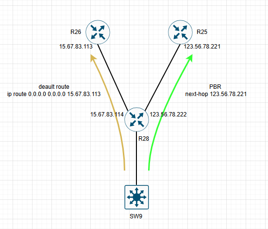

# Маршрутизация на основе политик (PBR).

### План работ:

1. Настроить политику маршрутизации для сетей в офисе Чокурдах 
2. Распределить трафик между двумя линками с провайдером.
3. Настроить отслеживание линка через технологию IP SLA.(только для IPv4)
4. Настроить для офиса Лабытнанги маршрут по-умолчанию.

## Схема стенда.



Настроим на SW29 маршрут по умолчанию в сторону маршрутизатора R28.

```
SW29#
ip route 0.0.0.0 0.0.0.0 192.168.254.1
```
На маршрутизаторе R28 настроим маршруты до сетей 192.168.50.0/24, 192.168.50.0/24.
Так же пропишем маршрут по умолчанию в сторону R26.

```
R28#
ip route 0.0.0.0 0.0.0.0 15.67.83.113
ip route 192.168.50.0 255.255.255.0 192.168.254.2
ip route 192.168.60.0 255.255.255.0 192.168.254.2

```

Настроим политику PBR для сети 192.168.60.0/24.
Сеть 192.168.60.0/24 пойдёт по маршруту default route через R26(15.67.83.113), сеть 192.168.60.0/24 направим на R25(123.56.78.221).

Создадим ACL c именем default_R25, разрешим сеть 192.168.60.0/24.
```
R28#
ip access-list extended default_R25
 permit ip 192.168.60.0 0.0.0.255 any
```
Создадим route-map default_R25, привяжем к карте ACL default_R25 и настроим следующий next-hop R25(123.56.78.221).

```
R28#
route-map default_R25 permit 10
 match ip address default_R25
 set ip next-hop 123.56.78.221
```
Привяжем route-map к входящему интерфейсу e0/2.
```
R28#
interface Ethernet0/2
 description R28 to SW29
 ip address 192.168.254.1 255.255.255.252
 ip policy route-map default_R25
```

Настроим проверку доступности ip адреса R25(123.56.78.221) с помощью IPSLA.

