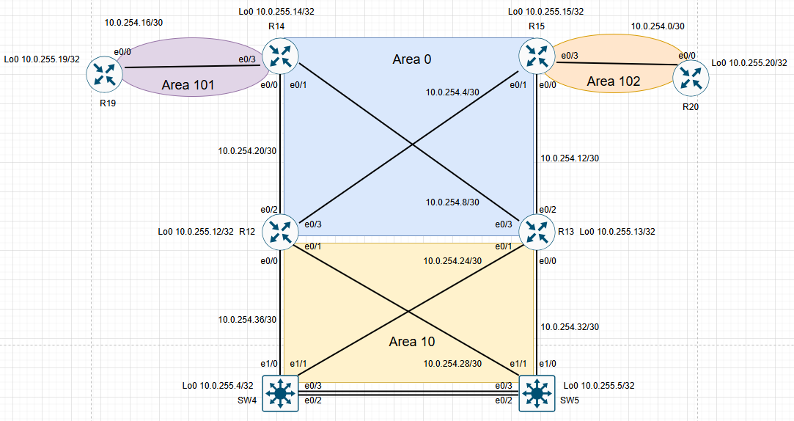

# OSPF. Фильтрация

# План работ:

1. Маршрутизаторы R14-R15 находятся в зоне 0 - backbone.
2. Маршрутизаторы R12-R13 находятся в зоне 10. Дополнительно к маршрутам должны получать маршрут по умолчанию.
3. Маршрутизатор R19 находится в зоне 101 и получает только маршрут по умолчанию.
4. Маршрутизатор R20 находится в зоне 102 и получает все маршруты, кроме маршрутов до сетей зоны 101.

Схема.



### Настроим зону AREA0 (Backbone).

```
R14#
router ospf 1
 router-id 10.0.255.14
!
interface Loopback0
 ip address 10.0.255.14 255.255.255.255
 ip ospf network point-to-point
 ip ospf 1 area 0
!
interface Ethernet0/0
 ip address 10.0.254.21 255.255.255.252
 ip ospf 1 area 0
!
interface Ethernet0/1
 ip address 10.0.254.9 255.255.255.252
 ip ospf 1 area 0
```
```
R15#
router ospf 1
 router-id 10.0.255.15
!
interface Loopback0
 ip address 10.0.255.15 255.255.255.255
 ip ospf network point-to-point
 ip ospf 1 area 0
!
interface Ethernet0/0
 description R15 to R13
 ip address 10.0.254.13 255.255.255.252
 ip ospf 1 area 0
!
interface Ethernet0/1
 description R15 to R12
 ip address 10.0.254.5 255.255.255.252
 ip ospf 1 area 0
```
```
R12#
router ospf 1
 router-id 10.0.255.12
!
interface Loopback0
 ip address 10.0.255.12 255.255.255.255
 ip ospf network point-to-point
 ip ospf 1 area 0
!
interface Ethernet0/2
 description R12 to R14
 ip address 10.0.254.22 255.255.255.252
 ip ospf 1 area 0
!
interface Ethernet0/3
 description R12 to R15
 ip address 10.0.254.6 255.255.255.252
 ip ospf 1 area 0
```
```
R13#
router ospf 1
 router-id 10.0.255.13
!
interface Loopback0
 ip address 10.0.255.13 255.255.255.255
 ip ospf network point-to-point
 ip ospf 1 area 0
!
interface Ethernet0/2
 description R13 to R15
 ip address 10.0.254.14 255.255.255.252
 ip ospf 1 area 0
!
interface Ethernet0/3
 description R13 to R14
 ip address 10.0.254.10 255.255.255.252
 ip ospf 1 area 0
```

### Соседство между маршрутизаторами поднялось.

```
R12#sh ip ospf neighbor

Neighbor ID     Pri   State           Dead Time   Address         Interface
10.0.255.14       1   FULL/DR         00:00:38    10.0.254.21     Ethernet0/2
10.0.255.15       1   FULL/DR         00:00:37    10.0.254.5      Ethernet0/3
```
```
R13#sh ip ospf neighbor

Neighbor ID     Pri   State           Dead Time   Address         Interface
10.0.255.15       1   FULL/DR         00:00:35    10.0.254.13     Ethernet0/2
10.0.255.14       1   FULL/DR         00:00:33    10.0.254.9      Ethernet0/3
```
```
R14#sh ip ospf neighbor

Neighbor ID     Pri   State           Dead Time   Address         Interface
10.0.255.12       1   FULL/BDR        00:00:32    10.0.254.22     Ethernet0/0
10.0.255.13       1   FULL/BDR        00:00:31    10.0.254.10     Ethernet0/1
```
```
R15#sh ip ospf neighbor

Neighbor ID     Pri   State           Dead Time   Address         Interface
10.0.255.13       1   FULL/BDR        00:00:31    10.0.254.14     Ethernet0/0
10.0.255.12       1   FULL/BDR        00:00:33    10.0.254.6      Ethernet0/1
```
### Настроим AREA 10
```
R12#
interface Ethernet0/0
 description R12 to SW4
 ip address 10.0.254.37 255.255.255.252
 ip ospf 1 area 10
!
interface Ethernet0/1
 description R12 to SW5
 ip address 10.0.254.29 255.255.255.252
 ip ospf 1 area 10
```
```
R13#
interface Ethernet0/0
 description R13 to SW5
 ip address 10.0.254.33 255.255.255.252
 ip ospf 1 area 10
!
interface Ethernet0/1
 description R13 to SW4
 ip address 10.0.254.25 255.255.255.252
 ip ospf 1 area 10
```
```
SW4#
router ospf 1
 router-id 10.0.255.4
 passive-interface default
 no passive-interface Ethernet1/0
 no passive-interface Ethernet1/1
!
interface Loopback0
 ip address 10.0.255.4 255.255.255.255
 ip ospf network point-to-point
 ip ospf 1 area 10
!
interface Ethernet1/0
 description SW4 to R12
 no switchport
 ip address 10.0.254.38 255.255.255.252
 ip ospf 1 area 10
 duplex auto
!
interface Ethernet1/1
 description SW4 to R13
 no switchport
 ip address 10.0.254.26 255.255.255.252
 ip ospf 1 area 10
 duplex auto
!
interface Vlan10
 ip address 10.0.10.2 255.255.255.0
 standby 10 ip 10.0.10.1
 standby 10 priority 150
 standby 10 preempt
 ip ospf 1 area 10
!
interface Vlan20
 ip address 10.0.20.2 255.255.255.0
 standby 20 ip 10.0.20.1
 standby 20 priority 110
 standby 20 preempt
 ip ospf 1 area 10
!
```
```
SW5#
router ospf 1
 router-id 10.0.255.5
 passive-interface default
 no passive-interface Ethernet1/0
 no passive-interface Ethernet1/1
!
interface Loopback0
 ip address 10.0.255.5 255.255.255.255
 ip ospf network point-to-point
 ip ospf 1 area 10
!
interface Ethernet1/0
 description SW5 to R13
 no switchport
 ip address 10.0.254.34 255.255.255.252
 ip ospf 1 area 10
 duplex auto
!
interface Ethernet1/1
 description SW5 to R12
 no switchport
 ip address 10.0.254.30 255.255.255.252
 ip ospf 1 area 10
 duplex auto
!
interface Vlan10
 ip address 10.0.10.3 255.255.255.0
 standby 10 ip 10.0.10.1
 standby 10 priority 110
 ip ospf 1 area 10
!
interface Vlan20
 ip address 10.0.20.3 255.255.255.0
 standby 20 ip 10.0.20.1
 standby 20 priority 150
 standby 20 preempt
 ip ospf 1 area 10
```
### Соседство между маршрутизаторами поднялось.

```
SW4#sh ip ospf neighbor

Neighbor ID     Pri   State           Dead Time   Address         Interface
10.0.255.13       1   FULL/DR         00:00:39    10.0.254.25     Ethernet1/1
10.0.255.12       1   FULL/DR         00:00:33    10.0.254.37     Ethernet1/0
```
```
SW5#sh ip ospf neighbor

Neighbor ID     Pri   State           Dead Time   Address         Interface
10.0.255.13       1   FULL/DR         00:00:37    10.0.254.33     Ethernet1/0
10.0.255.12       1   FULL/DR         00:00:31    10.0.254.29     Ethernet1/1
```
### Настроим R14 как ASBR маршрутизатор который будет распросранять маршрут по умолчанию c метрикой 20 с OSPF external type 1, а R15 c метрикой 30 для резервирования маршрута по умолчанию.

```
R14#
router ospf 1
 router-id 10.0.255.14
 default-information originate always metric 20 metric-type 1
```
```
R15#
router ospf 1
 router-id 10.0.255.15
 default-information originate always metric 30 metric-type 1
```
### Маршрут появился в таблице маршрутизации.

```
SW4#sh ip ro ospf
Codes: L - local, C - connected, S - static, R - RIP, M - mobile, B - BGP
       D - EIGRP, EX - EIGRP external, O - OSPF, IA - OSPF inter area
       N1 - OSPF NSSA external type 1, N2 - OSPF NSSA external type 2
       E1 - OSPF external type 1, E2 - OSPF external type 2
       i - IS-IS, su - IS-IS summary, L1 - IS-IS level-1, L2 - IS-IS level-2
       ia - IS-IS inter area, * - candidate default, U - per-user static route
       o - ODR, P - periodic downloaded static route, H - NHRP, l - LISP
       a - application route
       + - replicated route, % - next hop override

Gateway of last resort is 10.0.254.37 to network 0.0.0.0

O*E1  0.0.0.0/0 [110/40] via 10.0.254.37, 00:04:04, Ethernet1/0
                [110/40] via 10.0.254.25, 00:04:04, Ethernet1/1
      10.0.0.0/8 is variably subnetted, 20 subnets, 3 masks
O IA     10.0.254.4/30 [110/20] via 10.0.254.37, 00:45:00, Ethernet1/0
O IA     10.0.254.8/30 [110/20] via 10.0.254.25, 00:45:00, Ethernet1/1
O IA     10.0.254.12/30 [110/20] via 10.0.254.25, 00:45:00, Ethernet1/1
O IA     10.0.254.20/30 [110/20] via 10.0.254.37, 00:45:00, Ethernet1/0
O        10.0.254.28/30 [110/20] via 10.0.254.37, 00:45:00, Ethernet1/0
O        10.0.254.32/30 [110/20] via 10.0.254.25, 00:45:00, Ethernet1/1
O        10.0.255.5/32 [110/21] via 10.0.254.37, 00:36:24, Ethernet1/0
                       [110/21] via 10.0.254.25, 00:36:24, Ethernet1/1
O IA     10.0.255.12/32 [110/11] via 10.0.254.37, 00:45:00, Ethernet1/0
O IA     10.0.255.13/32 [110/11] via 10.0.254.25, 00:45:00, Ethernet1/1
O IA     10.0.255.14/32 [110/21] via 10.0.254.37, 00:04:09, Ethernet1/0
                        [110/21] via 10.0.254.25, 00:04:09, Ethernet1/1
O IA     10.0.255.15/32 [110/21] via 10.0.254.37, 00:45:00, Ethernet1/0
                        [110/21] via 10.0.254.25, 00:45:00, Ethernet1/1
```
### Настроим зону AREA 101, изменим тип зоны на totally stub для замены всех маршрутов, кроме локальных для зоны, на маршрут по умолчанию.

```
R14#
router ospf 1
 router-id 10.0.255.14
 area 101 stub no-summary
 default-information originate always metric 20 metric-type 1
!
interface Ethernet0/3
 ip address 10.0.254.17 255.255.255.252
 ip ospf 1 area 101
```
```
R19#
router ospf 1
 router-id 10.0.255.19
 area 101 stub
!
interface Loopback0
 ip address 10.0.255.19 255.255.255.255
 ip ospf network point-to-point
 ip ospf 1 area 101
!
interface Ethernet0/0
 description R19 to R14
 ip address 10.0.254.18 255.255.255.252
 ip ospf 1 area 101
```
### В таблице маршрутизации видим только один маршрут по умолчанию.
```
R19(config)#do sh ip ro ospf
Codes: L - local, C - connected, S - static, R - RIP, M - mobile, B - BGP
       D - EIGRP, EX - EIGRP external, O - OSPF, IA - OSPF inter area
       N1 - OSPF NSSA external type 1, N2 - OSPF NSSA external type 2
       E1 - OSPF external type 1, E2 - OSPF external type 2
       i - IS-IS, su - IS-IS summary, L1 - IS-IS level-1, L2 - IS-IS level-2
       ia - IS-IS inter area, * - candidate default, U - per-user static route
       o - ODR, P - periodic downloaded static route, H - NHRP, l - LISP
       a - application route
       + - replicated route, % - next hop override

Gateway of last resort is 10.0.254.17 to network 0.0.0.0

O*IA  0.0.0.0/0 [110/11] via 10.0.254.17, 00:18:12, Ethernet0/0

```
### Настроим зону AREA102 и отфильтруем маршруты с AREA101 на R15 чтобы сети 10.0.254.16/30 и 10.0.255.19/32 не попали в таблицу маршрутизации маршрутизатора R20 в зоне 102.

Настроим ospf в зоне 102.

```
R15#
interface Ethernet0/3
 description R14 to R19
 ip address 10.0.254.1 255.255.255.252
 ip ospf 1 area 102
```
```
R20#
router ospf 1
 router-id 10.0.255.20
!
interface Loopback0
 ip address 10.0.255.20 255.255.255.255
 ip ospf network point-to-point
 ip ospf 1 area 102
!
interface Ethernet0/0
 description R20 to R15
 ip address 10.0.254.2 255.255.255.252
 ip ospf 1 area 102
```
Настроим фильтрацию.
```
R15#
ip prefix-list AREA102 seq 5 deny 10.0.254.16/30
ip prefix-list AREA102 seq 10 deny 10.0.255.19/32
ip prefix-list AREA102 seq 15 permit 0.0.0.0/0 le 32
!
router ospf 1
 router-id 10.0.255.15
 area 102 filter-list prefix AREA102 in
 default-information originate always metric 30 metric-type 1
```
Маршруты с зоны 101 не попадают в зону 102
```
R20#sh ip ro ospf
Codes: L - local, C - connected, S - static, R - RIP, M - mobile, B - BGP
       D - EIGRP, EX - EIGRP external, O - OSPF, IA - OSPF inter area
       N1 - OSPF NSSA external type 1, N2 - OSPF NSSA external type 2
       E1 - OSPF external type 1, E2 - OSPF external type 2
       i - IS-IS, su - IS-IS summary, L1 - IS-IS level-1, L2 - IS-IS level-2
       ia - IS-IS inter area, * - candidate default, U - per-user static route
       o - ODR, P - periodic downloaded static route, H - NHRP, l - LISP
       a - application route
       + - replicated route, % - next hop override

Gateway of last resort is 10.0.254.1 to network 0.0.0.0

O*E1  0.0.0.0/0 [110/40] via 10.0.254.1, 00:22:44, Ethernet0/0
      10.0.0.0/8 is variably subnetted, 19 subnets, 3 masks
O IA     10.0.10.0/24 [110/31] via 10.0.254.1, 00:22:44, Ethernet0/0
O IA     10.0.20.0/24 [110/31] via 10.0.254.1, 00:22:44, Ethernet0/0
O IA     10.0.254.4/30 [110/20] via 10.0.254.1, 00:22:44, Ethernet0/0
O IA     10.0.254.8/30 [110/30] via 10.0.254.1, 00:22:44, Ethernet0/0
O IA     10.0.254.12/30 [110/20] via 10.0.254.1, 00:22:44, Ethernet0/0
O IA     10.0.254.20/30 [110/30] via 10.0.254.1, 00:22:44, Ethernet0/0
O IA     10.0.254.24/30 [110/30] via 10.0.254.1, 00:22:44, Ethernet0/0
O IA     10.0.254.28/30 [110/30] via 10.0.254.1, 00:22:44, Ethernet0/0
O IA     10.0.254.32/30 [110/30] via 10.0.254.1, 00:22:44, Ethernet0/0
O IA     10.0.254.36/30 [110/30] via 10.0.254.1, 00:22:44, Ethernet0/0
O IA     10.0.255.4/32 [110/31] via 10.0.254.1, 00:22:44, Ethernet0/0
O IA     10.0.255.5/32 [110/31] via 10.0.254.1, 00:22:44, Ethernet0/0
O IA     10.0.255.12/32 [110/21] via 10.0.254.1, 00:22:44, Ethernet0/0
O IA     10.0.255.13/32 [110/21] via 10.0.254.1, 00:22:44, Ethernet0/0
O IA     10.0.255.14/32 [110/31] via 10.0.254.1, 00:22:44, Ethernet0/0
O IA     10.0.255.15/32 [110/11] via 10.0.254.1, 00:22:44, Ethernet0/0
```
