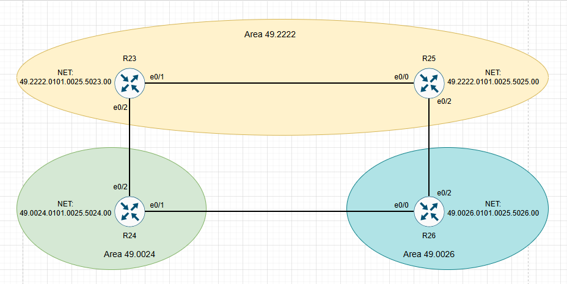

# Настроить протокол IS-IS для IPv4 и IPv6 в ISP Триада.

# План работ:

1. Настроитить IS-IS в ISP Триада.
2. R23 и R25 находятся в зоне 2222.
3. R24 находится в зоне 24.
4. R26 находится в зоне 26.

## Схема стенда.

### Присвоим NET адреса для процесса isis.

