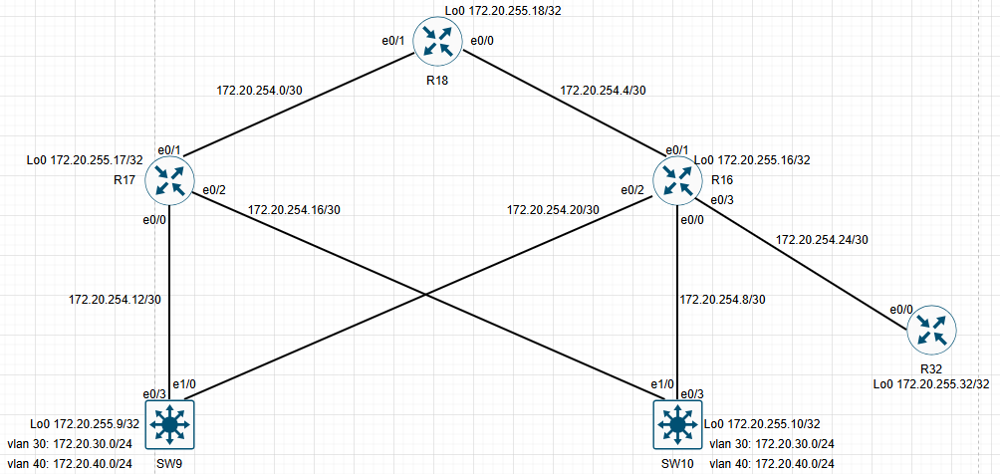

# Настроить EIGRP named-mode для IPv4 и IPv6 в офисе С.-Петербург.

# План работ:

1. В офисе С.-Петербург настроить EIGRP.
2. R32 получает только маршрут по умолчанию.
3. R16-17 анонсируют только суммарные префиксы.
4. Использовать EIGRP named-mode для настройки сети.

Настройка осуществляется одновременно для IPv4 и IPv6.

## Схема стенда.



### Включим поддержку ipv6 на всех маршрутизаторах.

```
ipv6 cef
ipv6 unicast-routing
```
### Настроим EIGRP , включим поддержку ipv6, так же включим ipv6 на интерфейсах.

На R16 настроим суммарный маршрут по умолчанию 0.0.0.0 0.0.0.0 в сторону R32, в сторону SW9 и SW10 настроим анонс суммарного маршрута 172.20.254.0 255.255.254.0 
```
router eigrp R16
 !
 address-family ipv4 unicast autonomous-system 1
  !
  af-interface default
   passive-interface
  exit-af-interface
  !
  af-interface Ethernet0/3
   summary-address 0.0.0.0 0.0.0.0
   no passive-interface
  exit-af-interface
  !
  af-interface Ethernet0/1
   no passive-interface
  exit-af-interface
  !
  af-interface Ethernet0/2
   summary-address 172.20.254.0 255.255.254.0
   no passive-interface
  exit-af-interface
  !
  af-interface Ethernet0/0
   summary-address 172.20.254.0 255.255.254.0
   no passive-interface
  exit-af-interface
  !
  topology base
  exit-af-topology
  network 172.20.254.0 0.0.1.255
  eigrp router-id 172.20.255.16
 exit-address-family
 !
 address-family ipv6 unicast autonomous-system 1
  !
  af-interface default
   passive-interface
  exit-af-interface
  !
  af-interface Ethernet0/3
   no passive-interface
  exit-af-interface
  !
  af-interface Ethernet0/1
   no passive-interface
  exit-af-interface
  !
  af-interface Ethernet0/2
   no passive-interface
  exit-af-interface
  !
  af-interface Ethernet0/0
   no passive-interface
  exit-af-interface
  !
  topology base
  exit-af-topology
 exit-address-family
!
interface Ethernet0/0
 description R16 to SW10
 ip address 172.20.254.9 255.255.255.252
 ipv6 enable
!
interface Ethernet0/1
 description R16 to R18
 ip address 172.20.254.6 255.255.255.252
 ipv6 enable
!
interface Ethernet0/2
 description R16 to SW9
 ip address 172.20.254.21 255.255.255.252
 ipv6 enable
!
interface Ethernet0/3
 description R16 to R32
 ip address 172.20.254.25 255.255.255.252
 ipv6 enable
```

```
R18#
router eigrp R18
 !
 address-family ipv4 unicast autonomous-system 1
  !
  af-interface default
   passive-interface
  exit-af-interface
  !
  af-interface Ethernet0/1
   no passive-interface
  exit-af-interface
  !
  af-interface Ethernet0/0
   no passive-interface
  exit-af-interface
  !
  topology base
  exit-af-topology
  network 172.20.254.0 0.0.1.255
  eigrp router-id 172.20.255.18
 exit-address-family
 !
 address-family ipv6 unicast autonomous-system 1
  !
  af-interface default
   passive-interface
  exit-af-interface
  !
  af-interface Ethernet0/0
   no passive-interface
  exit-af-interface
  !
  af-interface Ethernet0/1
   no passive-interface
  exit-af-interface
  !
  topology base
  exit-af-topology
 exit-address-family
!
interface Ethernet0/0
 description R18 to R16
 ip address 172.20.254.5 255.255.255.252
 ipv6 enable
!
interface Ethernet0/1
 description R18 to R17
 ip address 172.20.254.2 255.255.255.252
 ipv6 enable
```
```
R32#

```
