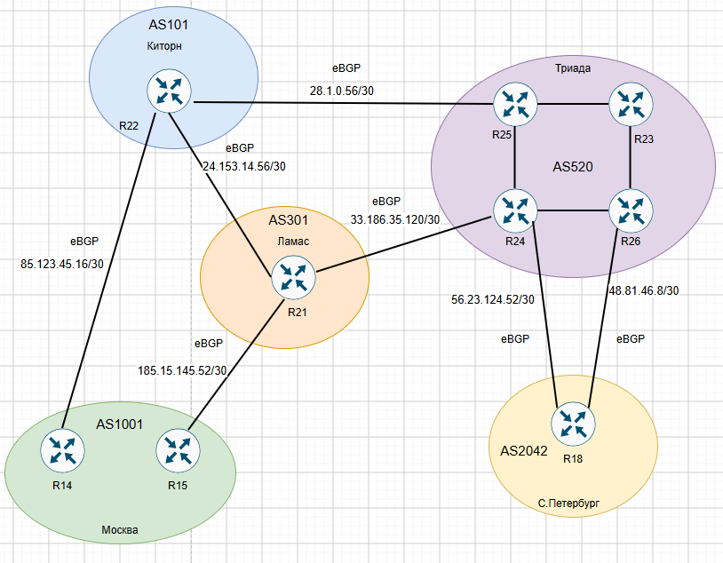

# Настроить BGP между автономными системами и организовать доступность между офисами Москва и С.-Петербург.

# План работ:

1. Настроить eBGP между офисом Москва и двумя провайдерами - Киторн и Ламас.
2. Настроить eBGP между провайдерами Киторн и Ламас.
3. Настроить eBGP между Ламас и Триада.
4. Настроить eBGP между офисом С.-Петербург и провайдером Триада.
5. Организовать IP доступность между пограничными роутерами офисов Москва и С.-Петербург.

## Схема стенда.

