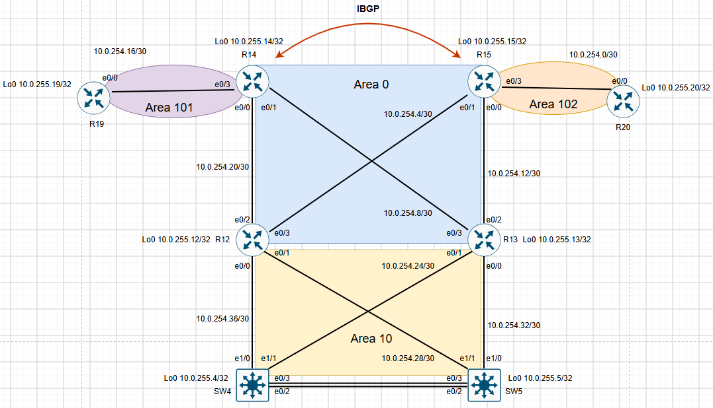
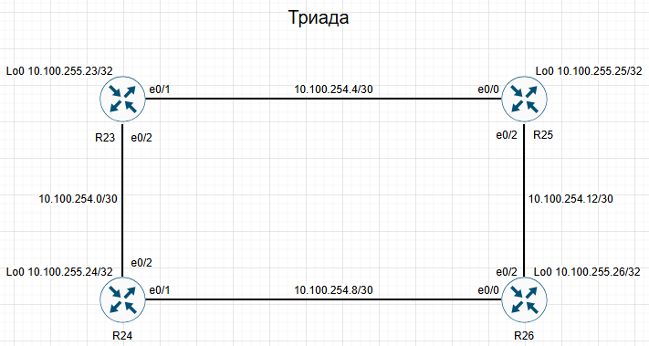

# Настроить iBGP в офисе Москва и в сети провайдера Триада для обеспечения полной IP-связности всех сетей.

# План работ:

1. Настроить iBGP в офисом Москва между маршрутизаторами R14 и R15.
2. Настроить iBGP в провайдере Триада, с использованием RR.
3. Настроить офис Москва так, чтобы приоритетным провайдером стал Ламас.
4. Настроить офиса С.-Петербург так, чтобы трафик до любого офиса распределялся по двум линкам одновременно.
5. Все сети в лабораторной работе должны иметь IP связность.

## Схема стенда.


### Перед настройкой IBGP на маршрутизаторе R14, уберем анонс шлюза по умолчанию с протокола ospf.(#no default-information originate)
```
R14#
router ospf 1
 router-id 10.0.255.14
 area 101 stub no-summary
 area 109 stub
```
### Настроим IBGP в офисе Москва, а так же сделаем приоритетным провайдером ISP Ламас.


Настроим IBGP сессию между R14 и R15, на R15 повысим значение атрибута local preference сделав его маршруты приоритетнее для исходящего трафика.
Создадим route-map LOCAL_PREF_LAMAS и привяжем её к соседу eBGP neighbor 185.15.145.53

```
R15#
route-map LOCAL_PREF_LAMAS permit 10
 set local-preference 200
```
```
router bgp 1001
 bgp router-id 10.0.255.15
 bgp log-neighbor-changes
 network 10.0.255.15 mask 255.255.255.255
 neighbor 10.0.255.14 remote-as 1001
 neighbor 10.0.255.14 update-source Loopback0
 neighbor 10.0.255.14 next-hop-self
 neighbor 185.15.145.53 remote-as 301
 neighbor 185.15.145.53 route-map LOCAL_PREF_LAMAS in
```
На R14 настроим IBGP сессию с R15 и изменим значение атрибута as-path, добавим наш номер AS в as-path чтобы для провайдера Киторн полученные от нам маршруты были менее приоритетными.
```
R14#
route-map SET_AS_PATH_PREPEND permit 10
 set as-path prepend 1001 1001 1001
```
```
router bgp 1001
 bgp router-id 10.0.255.14
 bgp log-neighbor-changes
 network 10.0.255.14 mask 255.255.255.255
 neighbor 10.0.255.15 remote-as 1001
 neighbor 10.0.255.15 update-source Loopback0
 neighbor 10.0.255.15 next-hop-self
 neighbor 85.123.45.17 remote-as 101
 neighbor 85.123.45.17 route-map SET_AS_PATH_PREPEND out
```
Проверим на R14 и R22 маршруты.
На R14 видим маршруты от R15 приоритетнее так как local preference 200.
```
R14#sh ip bgp
BGP table version is 12, local router ID is 10.0.255.14
Status codes: s suppressed, d damped, h history, * valid, > best, i - internal,
              r RIB-failure, S Stale, m multipath, b backup-path, f RT-Filter,
              x best-external, a additional-path, c RIB-compressed,
Origin codes: i - IGP, e - EGP, ? - incomplete
RPKI validation codes: V valid, I invalid, N Not found

     Network          Next Hop            Metric LocPrf Weight Path
 *>  10.0.255.14/32   0.0.0.0                  0         32768 i
 r>i 10.0.255.15/32   10.0.255.15              0    100      0 i
 *>i 10.100.255.23/32 10.0.255.15              0    200      0 301 520 i
 *                    85.123.45.17                           0 101 520 i
 *   10.100.255.24/32 85.123.45.17                           0 101 520 i
 *>i                  10.0.255.15              0    200      0 301 520 i
 *   10.100.255.25/32 85.123.45.17                           0 101 520 i
 *>i                  10.0.255.15              0    200      0 301 520 i
 *>i 10.100.255.26/32 10.0.255.15              0    200      0 301 520 i
 *                    85.123.45.17                           0 101 520 i
 *>i 172.20.255.18/32 10.0.255.15              0    200      0 301 520 2042 i
 *                    85.123.45.17                           0 101 520 2042 i
```
Видим что от R22 в сторону R14 маршруты не приоритетные так как as-path длиннее.
```
R22#sh ip bgp
BGP table version is 10, local router ID is 193.12.255.22
Status codes: s suppressed, d damped, h history, * valid, > best, i - internal,
              r RIB-failure, S Stale, m multipath, b backup-path, f RT-Filter,
              x best-external, a additional-path, c RIB-compressed,
Origin codes: i - IGP, e - EGP, ? - incomplete
RPKI validation codes: V valid, I invalid, N Not found

     Network          Next Hop            Metric LocPrf Weight Path
 *   10.0.255.14/32   28.1.0.58                              0 520 301 1001 i
 *>                   24.153.14.58                           0 301 1001 i
 *                    85.123.45.18             0             0 1001 1001 1001 1001 i
 *   10.0.255.15/32   28.1.0.58                              0 520 301 1001 i
 *>                   24.153.14.58                           0 301 1001 i
 *                    85.123.45.18                           0 1001 1001 1001 1001 i
 *   10.100.255.23/32 85.123.45.18                           0 1001 1001 1001 1001 301 520 i
 *                    24.153.14.58                           0 301 520 i
 *>                   28.1.0.58                0             0 520 i
 *   10.100.255.24/32 85.123.45.18                           0 1001 1001 1001 1001 301 520 i
     Network          Next Hop            Metric LocPrf Weight Path
 *                    24.153.14.58                           0 301 520 i
 *>                   28.1.0.58                              0 520 i
 *   10.100.255.25/32 85.123.45.18                           0 1001 1001 1001 1001 301 520 i
 *                    24.153.14.58                           0 301 520 i
 *>                   28.1.0.58                              0 520 i
 *   10.100.255.26/32 85.123.45.18                           0 1001 1001 1001 1001 301 520 i
 *                    24.153.14.58                           0 301 520 i
 *>                   28.1.0.58                              0 520 i
 *   172.20.255.18/32 85.123.45.18                           0 1001 1001 1001 1001 301 520 2042 i
 *                    24.153.14.58                           0 301 520 2042 i
 *>                   28.1.0.58                              0 520 2042 i

```
### Настроим IBGP в ISP Триада. В роли Route Reflector будет R25.
### В роли IGP настроен протокол ISIS.

```
R25#
router bgp 520
 bgp router-id 10.100.255.25
 bgp log-neighbor-changes
 neighbor AS520 peer-group
 neighbor AS520 remote-as 520
 neighbor AS520 update-source Loopback0
 neighbor AS520 route-reflector-client
 neighbor AS520 next-hop-self
 neighbor 10.100.255.23 peer-group AS520
 neighbor 10.100.255.24 peer-group AS520
 neighbor 10.100.255.26 peer-group AS520
```
```
R23#
router bgp 520
 bgp router-id 10.100.255.23
 bgp log-neighbor-changes
 network 10.100.255.23 mask 255.255.255.255
 neighbor 10.100.255.25 remote-as 520
 neighbor 10.100.255.25 update-source Loopback0
 neighbor 10.100.255.25 next-hop-self
 neighbor 28.1.0.57 remote-as 101
```
```
R24#
router bgp 520
 bgp router-id 10.100.255.24
 bgp log-neighbor-changes
 network 10.100.255.24 mask 255.255.255.255
 neighbor 10.100.255.25 remote-as 520
 neighbor 10.100.255.25 update-source Loopback0
 neighbor 10.100.255.25 next-hop-self
 neighbor 33.186.35.121 remote-as 301
 neighbor 56.23.124.54 remote-as 2042
```
```
R26#
router bgp 520
 bgp router-id 10.100.255.26
 bgp log-neighbor-changes
 network 10.100.255.26 mask 255.255.255.255
 neighbor 10.100.255.25 remote-as 520
 neighbor 10.100.255.25 update-source Loopback0
 neighbor 10.100.255.25 next-hop-self
 neighbor 48.81.46.10 remote-as 2042
```
Маршруты по ibgp приходят.
```
R24#sh ip bgp
BGP table version is 9, local router ID is 10.100.255.24

     Network          Next Hop            Metric LocPrf Weight Path
 *>  10.0.255.14/32   33.186.35.121                          0 301 1001 i
 *>  10.0.255.15/32   33.186.35.121                          0 301 1001 i
 r>i 10.100.255.23/32 10.100.255.23            0    100      0 i
 *>  10.100.255.24/32 0.0.0.0                  0         32768 i
 r>i 10.100.255.25/32 10.100.255.25            0    100      0 i
 r>i 10.100.255.26/32 10.100.255.26            0    100      0 i
 * i 172.20.255.18/32 10.100.255.26            0    100      0 2042 i
 *>                   56.23.124.54             0             0 2042 i
```
```
R26#sh ip bgp
BGP table version is 9, local router ID is 10.100.255.26

     Network          Next Hop            Metric LocPrf Weight Path
 *>i 10.0.255.14/32   10.100.255.24            0    100      0 301 1001 i
 *>i 10.0.255.15/32   10.100.255.24            0    100      0 301 1001 i
 r>i 10.100.255.23/32 10.100.255.23            0    100      0 i
 r>i 10.100.255.24/32 10.100.255.24            0    100      0 i
 r>i 10.100.255.25/32 10.100.255.25            0    100      0 i
 *>  10.100.255.26/32 0.0.0.0                  0         32768 i
 *>  172.20.255.18/32 48.81.46.10              0             0 2042 i

```
```
R23#sh ip bgp
BGP table version is 10, local router ID is 10.100.255.23

     Network          Next Hop            Metric LocPrf Weight Path
 *>i 10.0.255.14/32   10.100.255.24            0    100      0 301 1001 i
 *                    28.1.0.57                              0 101 301 1001 i
 *   10.0.255.15/32   28.1.0.57                              0 101 301 1001 i
 *>i                  10.100.255.24            0    100      0 301 1001 i
 *>  10.100.255.23/32 0.0.0.0                  0         32768 i
 r>i 10.100.255.24/32 10.100.255.24            0    100      0 i
 r>i 10.100.255.25/32 10.100.255.25            0    100      0 i
 r>i 10.100.255.26/32 10.100.255.26            0    100      0 i
 *>i 172.20.255.18/32 10.100.255.26            0    100      0 2042 i

```
### Настроим в офисе Санкт - Петербург маршрутизатор R18 таким образом чтобы он распределял трафик по двум линкам одновременно.
### Для этого пропишем maximum-paths 2.

```
R18#
router bgp 2042
 bgp router-id 172.20.255.18
 bgp log-neighbor-changes
 network 172.20.255.18 mask 255.255.255.255
 neighbor 48.81.46.9 remote-as 520
 neighbor 56.23.124.53 remote-as 520
 maximum-paths 2
```
```
R18#sh ip ro bgp

Gateway of last resort is not set

      10.0.0.0/32 is subnetted, 6 subnets
B        10.0.255.14 [20/0] via 56.23.124.53, 03:38:32
                     [20/0] via 48.81.46.9, 03:38:32
B        10.0.255.15 [20/0] via 56.23.124.53, 03:38:32
                     [20/0] via 48.81.46.9, 03:38:32
B        10.100.255.23 [20/0] via 56.23.124.53, 03:39:03
                       [20/0] via 48.81.46.9, 03:39:03
B        10.100.255.24 [20/0] via 56.23.124.53, 03:39:03
                       [20/0] via 48.81.46.9, 03:39:03
B        10.100.255.25 [20/0] via 56.23.124.53, 03:39:03
                       [20/0] via 48.81.46.9, 03:39:03
B        10.100.255.26 [20/0] via 56.23.124.53, 03:38:35
                       [20/0] via 48.81.46.9, 03:38:35

```
