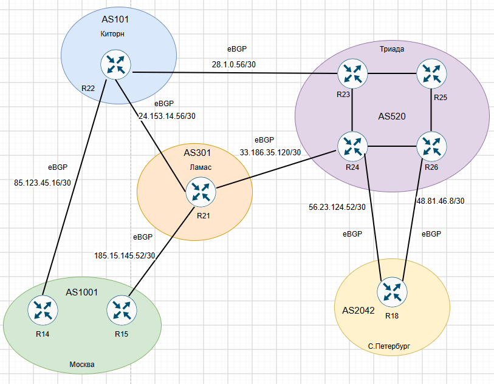

# Настроить фильтрацию в офисах Москва и С.-Петербург.

# План работ:

1. Настроить фильтрацию в офисе Москва так, чтобы не появилось транзитного трафика(As-path).
2. Настроить фильтрацию в офисе С.-Петербург так, чтобы не появилось транзитного трафика(Prefix-list).
3. Настроить провайдера Киторн так, чтобы в офис Москва отдавался только маршрут по умолчанию.
4. Настроить провайдера Ламас так, чтобы в офис Москва отдавался только маршрут по умолчанию и префикс офиса С.-Петербург.
5. Все сети в лабораторной работе должны иметь IP связность.

## Схема стенда.



### Настроим R14 и R15 в Москве так чтобы не было транзитного трафика. Используем filter-list.
```
R14#
ip as-path access-list 55 permit ^$
!
router bgp 1001
 bgp router-id 10.0.255.14
 neighbor 85.123.45.17 filter-list 55 out
```


```
R15#
ip as-path access-list 55 permit ^$
!
router bgp 1001
 bgp router-id 10.0.255.15
 neighbor 185.15.145.53 filter-list 55 out
```
